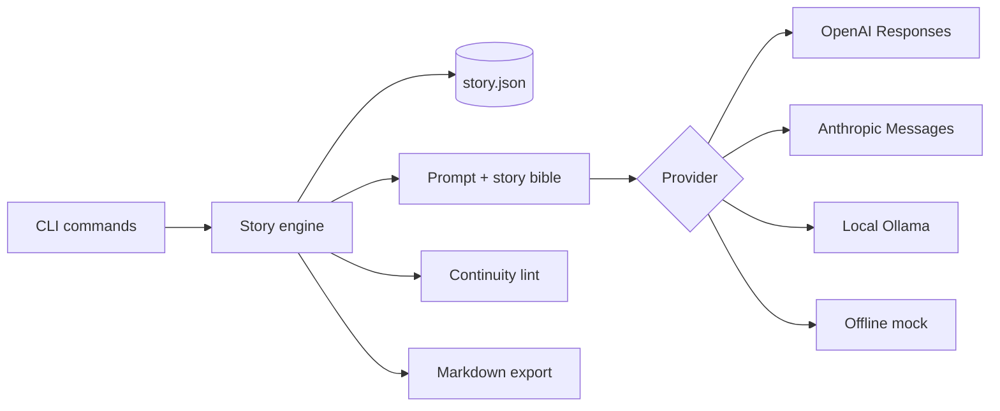

# FanficAI

[](https://github.com/jacques758/fanficai/actions/workflows/ci.yml)
[](LICENSE)

A command-line fiction co-writer that keeps a persistent story bible, generates outlines and drafts, checks continuity offline, tracks provider usage, and exports clean Markdown.

## Features

- Persistent project metadata, cast, canon notes, style, constraints, and chapter state.
- Outline, draft, continue, critique, read, show, and Markdown export commands.
- Offline continuity/craft linting for POV drift, tense drift, unknown names, and avoid-list conflicts.
- OpenAI Responses API, Anthropic Messages API, local Ollama, and deterministic mock providers.
- Token and call tracking; optional cost estimates use rates you configure, avoiding stale built-in pricing.
- Offline-first test suite with 25 original tests plus packaging/provider checks.

## Quick start

```bash
python -m pip install -e .
fanficai init --title "The Long Way Round" --fandom Original --rating T
fanficai char "Rin" --role protagonist --traits "stubborn,precise"
fanficai --provider mock outline -n 4
fanficai --provider mock write -c 1 -w 900
fanficai check -c 1
fanficai export --out manuscript.md
```

## Architecture



## Provider configuration

| Variable | Purpose |
|---|---|
| `FANFICAI_PROVIDER` | `mock`, `openai`, `anthropic`, `ollama`, or `auto` |
| `FANFICAI_MODEL` | Provider model ID |
| `OPENAI_API_KEY` | OpenAI authentication |
| `ANTHROPIC_API_KEY` | Anthropic authentication |
| `OLLAMA_BASE_URL` | Local endpoint; default `http://localhost:11434` |
| `FANFICAI_INPUT_USD_PER_MTOK` | Optional current input-token rate |
| `FANFICAI_OUTPUT_USD_PER_MTOK` | Optional current output-token rate |

Copy `.env.example` as a reference, but export secrets through your shell or secret manager. Never commit `.env`.

## Commands

| Command | Purpose |
|---|---|
| `init` | Create a story project |
| `char` | Add/update a cast member |
| `outline` | Generate chapter plans |
| `write` | Draft a chapter |
| `continue` | Extend a draft |
| `critique` | Request craft feedback |
| `check` | Run offline continuity lint |
| `show` / `read` | Inspect project state |
| `export` | Write the manuscript to Markdown |

## Tests

```bash
python -m unittest discover -s tests -v
fanficai --help
```

The suite is fully offline: hosted provider calls are mocked. It covers persistence, outlining, drafting, continuation, safety rules, continuity checks, usage tracking, CLI workflows, Responses API parsing, Ollama configuration, and the installed console entry point.

## Demonstration

`demo/` contains one original-fiction project and exported manuscript. It uses no copyrighted setting or characters.

```text
$ fanficai --provider mock check -c 1
  - POV appears consistent with Rin
  - past-tense pattern is consistent
  - no avoid-list terms found
```

## Safety and limitations

- The engine refuses explicit sexual material and any sexualization of minors.
- Provider outputs can be inaccurate, repetitive, or inconsistent; review before publishing.
- Continuity lint uses transparent heuristics, not semantic proof.
- Authors are responsible for platform rules, attribution, copyright, and consent.
- Project files are local JSON and are not encrypted.

